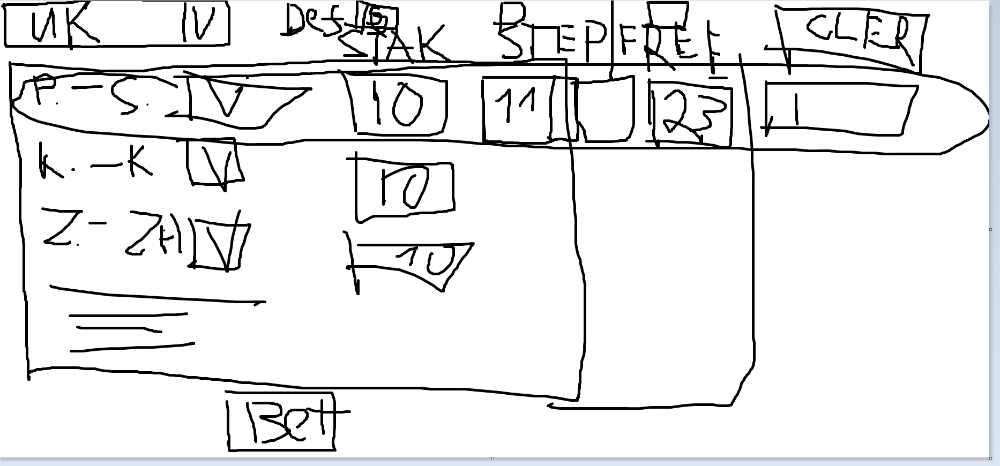
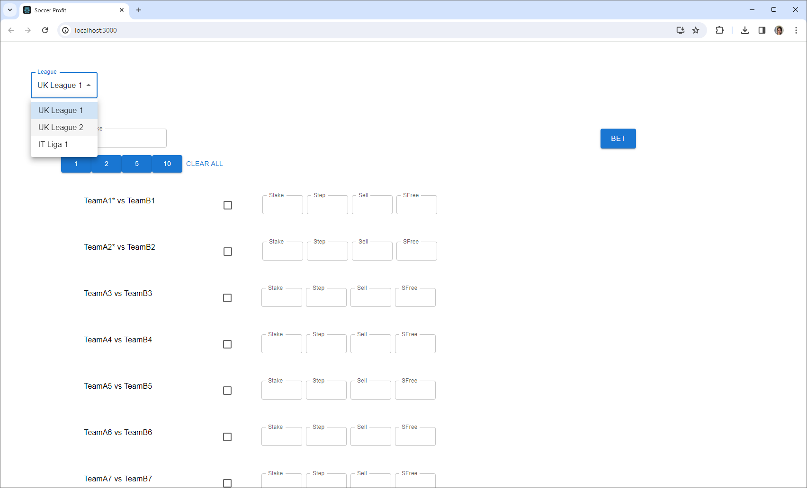

## Todo


Country:
[UK][UKid=1, ITAid=2]
League:
[Championship]

Table
			 Default:|Stake|Steps|Sell|SFree
List Matches|Checkbox|Stake|Steps|Sell|SFree

UK vs SPA   |[X]      |10£ |11|   0.5%|23

      1.55(Sell 5 on ods 1.44) and sell rest on 1.32     
	  
	  1x(Button BET) 1x(Clear)

### Implementing the POST request

The POST request is made from the MatchesContainer. The requests sends a list of Bet objects in its body. There will be a new TypeScript interface, Bet, similar to the backend class BetDTO:

```
public class BetDTO {
    private Long matchId;
    private int stake;
    private int step;
    private int sell;
    private int stepFreeRoll;
}
```

There will be a useState hook in MatchesContainer that will keep a list (or a set) of these Bet objects. When the user changes Stake, Step or Sell in one of matches, this event must be handled in MatchesContainer, and the corresponding Bet object must be updated. When a checkbox is checked, a new Bet object is added to the list. The list of Bet objects reflects current state of the matches. The Bet objects are always ready to be packed and sent in a POST request.

### Endpoints
#### GET
- localhost:8080/api/matches/{leagueId}
#### POST
- localhost:8080/api/matches/bet

### Match DTO:
- matchId
- leagueId
- teamA
- teamB

    private Long matchId;
    private Long leagueId;
    private String teamA;
    private String teamB;

### Bet DTO:
- matchId
- stake
- step
- sell
- stepFreeRoll

    private Long matchId;
    private int stake;
    private int step;
    private int sell;
    private int stepFreeRoll;

### MatchService methods
```
List<Match> getAllMatches(leagueId);
void placeBets(List<Bet>)
```

### Useful commands 
`npm start`

Runs the app in the development mode.\
Open [http://localhost:3000](http://localhost:3000) to view it in the browser.



### Writing Selenium tests in Java

#### Installation


Selenium uses WebDriver (ChromeDriver) to control the browser:

```
Test.java -> ChromeDriver -> Chrome
```

The path to chromedriver.exe (on Windows) must be in the PATH environment variable. Chrome must be at a standard path. When Chrome is updated, a new version of ChromeDriver must be downloaded and saved, PATH updated.

#### The Java/Maven project

Use Maven to create a simple Maven project in a subdirectory. The project will implement Selenium tests. There will be these depencencies in pom.xml: Selenium and TestNG. The pom.xml file will also have a build target pointing at the testng.xml file (where all the test files will be listed):

```
pom.xml -> testng.xml -> ReactAppSeleniumTest.java
```

#### Using Selenium on MacOS

```
VS Code + Extension Pack for Java, Maven for Java
JDK
Maven
    add to $PATH
Java: Create Java Project > Maven > maven-archetype-quickstart
Edit pom.xml
    dependencies - Selenium; TestNG
    plugins - ...
Check Chrome version, download chromedriver accordingly
    save in /usr/local/bin
```

#### The test

1. Open the web page in Chrome
2. Inspect the HTML element (Inspect, F12)
3. Develop a selector for the HTML element in the console (F12)
```
document.querySelectorAll('p')
document.querySelectorAll('.MuiTypography-body1')[0]
document.querySelector('#demo-simple-select')
document.querySelectorAll('button')[1]
document.evaluate("(//input[@id='box'])[1]", document, null, XPathResult.FIRST_ORDERED_NODE_TYPE).singleNodeValue
```
4. Implement the same selector in a Selenium test
```
WebElement secondParaElement = driver.findElements(By.className("MuiTypography-body1")).get(1);
```
5. Implement a waiting strategy in the test to wait for the element
```
WebElement buttonElement = wait.until(ExpectedConditions.visibilityOfElementLocated(By.xpath("(//button)[2]")));
```
6. Implement asserts in the test
```
Assert.assertEquals(actualButtonText, expectedButtonText, "Button text mismatch");
```
